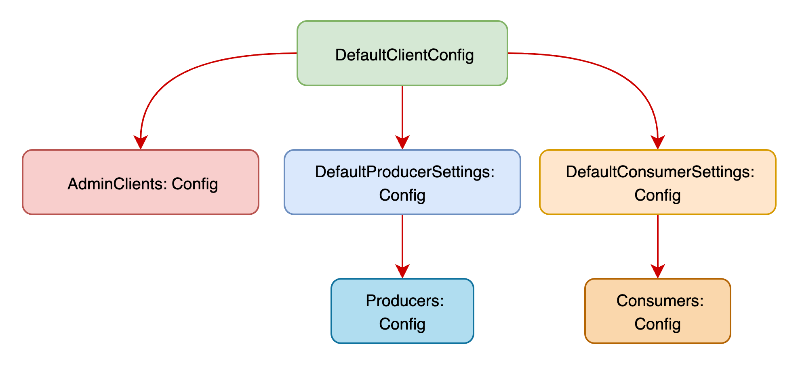

# GR8Tech.TestUtils.KafkaClient

Authors: Mykola Panasiuk

## TL;DR
This repository contains primary the source code for building NuGet package to Open Source:
- **GR8Tech.TestUtils.KafkaClient**

This NuGet developed to communicate with Kafka brokers. It contains: 
- `KafkaAdminClient : IKafkaAdminClient`
- `KafkaProducer : IKafkaProducer`
- `KafkaConsumer : IKafkaConsumer`

### Key features

#### General
- Serilog as a logger with Context for each class
- Ability to read date from a settings json file
- Support of template variables

#### KafkaAdminClient
- Support cascade settings
- Support full range of kafka client config
- Create default topics from the settings json file
- Delete default topics from the settings json file
- Create topic
- Delete topic

#### KafkaProducer
- Support cascade settings
- Support full range of kafka client config
- Produce kafka message in different ways

#### KafkaConsumer
- Support cascade settings
- Support full range of kafka client config
- Subscribe or Assigne
- Configurable internal buffer
- Ability to filter message after consume and saving to the internal buffer
- Wait for messages to appear with condition
- Wait for no message

## Settings file

Settings file might be named either `test-settings.json` or `appsettings.json`. 

### The simplest example for one Producer

```json
{
  "KafkaSettings": {
    "Producers": {
      "my-awesome_producer": {
        "Topic": "my-awesome-topic-local",
        "Config": {
          "bootstrap.servers": "localhost:9092"
        }
      }
    }
  }
}
```

### The simplest example for one AdminClient, Producer and Consumer
```json
{
  "KafkaSettings": {
    "TemplateVariables": {
      "env": "local"
    },
    "DefaultClientConfig": {
      "bootstrap.servers": "localhost:9092"
    },
    "AdminClients": {
      "localhost": {
        "Topics": [
          {
            "Name": "my-awesome-topic-${env}"
          }
        ]
      }
    },
    "Consumers": {
      "my-awesome_consumer": {
        "Topic": "my-awesome-topic-${env}"
      }
    },
    "Producers": {
      "my-awesome_producer": {
        "Topic": "my-awesome-topic-${env}"
      }
    }
  }
}
```

### Full example for one AdminClient, Producer and Consumer
```json
{
  "KafkaSettings": {
    "TemplateVariables": {
      "env": "local"
    },
    "DefaultClientConfig": {
      "bootstrap.servers": "localhost:9092",
      "message.max.bytes": "200000000",
      "security.protocol": "plaintext",
      "ssl.certificate.location": "",
      "ssl.ca.location": "",
      "ssl.key.location": ""
    },
    "DefaultConsumerSettings": {
      "BufferSize": 5000,
      "WaiterSettings": {
        "RetryCount": 1,
        "Interval": "00:00:01"
      },
      "SubscribeOverAssign": false,
      "IndependentConfig": false,
      "Config": {
        "group.id": "test-group",
        "auto.offset.reset": "latest"
      }
    },
    "DefaultProducerSettings": {
      "IndependentConfig": false,
      "Config": {
        "partitioner": "murmur2",
        "acks": "all",
        "message.timeout.ms": "20000"
      }
    },
    "AdminClients": {
      "localhost": {
        "IndependentConfig": false,
        "Config": {
          "bootstrap.servers": "localhost:9092"
        },
        "DefaultTopicSettings": {
          "PartitionCount": 1,
          "ReplicaCount": 1,
          "IndependentTopicConfig": false,
          "TopicConfig": {
            "cleanup.policy": "delete"
          }
        },
        "Topics": [
          {
            "Name": "simple_string_string-${env}",
            "PartitionCount": 1,
            "ReplicaCount": 1,
            "IndependentTopicConfig": false,
            "TopicConfig": {
              "cleanup.policy": "delete"
            }
          }
        ]
      }
    },
    "Consumers": {
      "simple_string_string": {
        "Topic": "simple_string_string-${env}",
        "BufferSize": 5000,
        "WaiterSettings": {
          "RetryCount": 10,
          "Interval": "00:00:01"
        },
        "SubscribeOverAssign": false,
        "IndependentConfig": true,
        "Config": {
          "bootstrap.servers": "localhost:9092",
          "group.id": "consumer_group_id",
          "auto.offset.reset": "latest"
        }
      }
    },
    "Producers": {
      "simple_string_string": {
        "Topic": "simple_string_string-${env}",
        "IndependentConfig": false,
        "Config": {
          "bootstrap.servers": "localhost:9092"
        }
      }
    }
  }
}
```

As you can see above from the full list of settings available to you on all levels, there are a few top-level groups of settings:
- `TemplateVariables`
- `DefaultClientConfig`
- `DefaultConsumerSettings`
- `DefaultProducerSettings`
- `AdminClients`
- `Consumers`
- `Producers`

Thanks to Nullable types you do NOT need to specify each line of settings, all of them are handled implicitly with default values. Also all settings are based on Confluent.Kafka types:

- `ClientConfig` is a base for:
  - `AdminClientConfig`
  - `ConsumerConfig`
  - `ProducerConfig`

Below you can look at the settings diagram:


## Code examples
All examples below will be shown for next settings json file:

```json
{
  "KafkaSettings": {
    "TemplateVariables": {
      "env": "local"
    },
    "DefaultClientConfig": {
      "bootstrap.servers": "localhost:9092"
    },
    "AdminClients": {
      "localhost": {
        "Topics": [
          {
            "Name": "my-awesome-topic-${env}"
          },
          {
            "Name": "my-awesome-topic-avro-${env}"
          }
        ]
      }
    },
    "Consumers": {
      "my-awesome-consumer": {
        "Topic": "my-awesome-topic-${env}"
      },
      "my-awesome-avro-consumer": {
        "Topic": "my-awesome-topic-avro-${env}"
      }
    },
    "Producers": {
      "my-awesome-producer": {
        "Topic": "my-awesome-topic-${env}"
      },
      "my-awesome-avro-producer": {
        "Topic": "my-awesome-topic-avro-${env}"
      }
    }
  }
}
```

### KafkaAdminClient examples
```c#
var adminClient = new("localhost");

// Create default topics. New topics "my-awesome-topic-local" will be created
await adminClient.CreateDefaultTopics();

// Create another topic, which is not listed in a settings json file
var topicName = "my-new-topic"
await adminClient.CreateTopic(topicName);

// Delete just created topic
await adminClient.DeleteTopic(topicName);
```

### KafkaProducer examples
```c#
var producerName = "my-awesome-producer";
var producerAvroName = "my-awesome-avro-producer";

// Create <string, string> producer from the settings json file
var producer = new KafkaProducer<string, string>(producerName);

// Create <string, object> producer from the settings json file
var producer = new KafkaProducer<string, object>(producerName);

// Create AVRO producer from the settings json file
var schemaRegistryClient = new CachedSchemaRegistryClient(
    new SchemaRegistryConfig{ Url = "http://localhost:8081" });

var producerAvro = new KafkaProducer<string, SimpleAvroClass>(
    producerAvroName,
    valueSerializer: new AvroSerializer<SimpleAvroClass>(schemaRegistryClient)
                     .AsSyncOverAsync());

// Produce simple message
var key = "myKey";
var value = "myValue";

var result = await producer.ProduceMessage(key, value);
```

### KafkaConsumer examples
```c#
var consumerName = "my-awesome-consumer";
var consumerAvroName = "my-awesome-avro-consumer";

// Create <string, string> consumer from the settings json file
var consumer = new KafkaConsumer<string, string>(consumerName);

// Create <string, object> consumer from the settings json file
var consumer = new KafkaConsumer<string, object>(consumerName);

// Create AVRO consumer from the settings json file
var schemaRegistryClient = new CachedSchemaRegistryClient(
    new SchemaRegistryConfig{ Url = "http://localhost:8081" });

var consumerAvro = new KafkaConsumer<string, SimpleAvroClass>(
    consumerAvroName,
    valueDeserializer: new AvroDeserializer<SimpleAvroClass>(schemaRegistryClient)
                     .AsSyncOverAsync());

// Start consuming
consumer.Start();

// Add filter for consuming 
consumer.AddFilter("my-filter", x => x.Message.Key == keyToSearch);

// Remove filter for consuming 
consumer.RemoveFilter("my-filter");

// Wait and get message 
var result = await consumer.WaitAndGetMessage(x => x.Message.Key == key);

// Wait and get messages 
var result = await consumer.WaitAndGetMessages(x => 
    x.Message.Key == key1 || x.Message.Key == key2);

// Wait and get messages with condition
var result = await consumer.WaitAndGetMessages(x => 
    x.Message.Key == key1 || x.Message.Key == key2, 
    r => r.Count == 2);

// Remove saved masseges from internal buffer
consumer.RemoveMessages(x => x.Message.Key == key);
```


